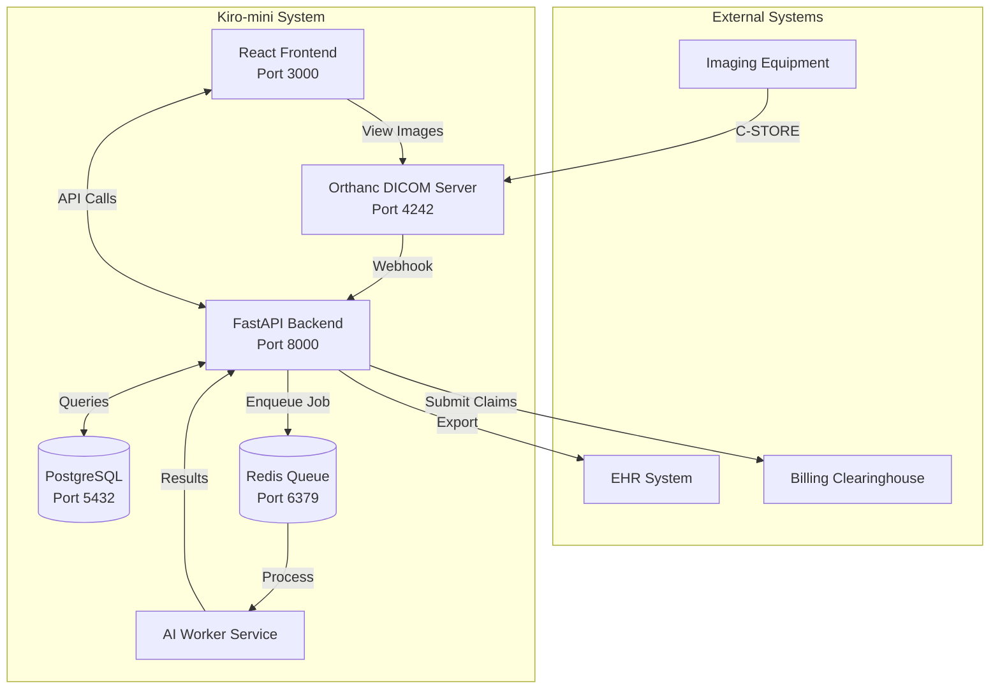

# Design Document

## Overview

Kiro-mini is a high-performance medical imaging and billing integration system designed for rapid report generation and immediate billing submission. The system architecture prioritizes speed and automation, enabling radiologists to generate complete, billable reports within 1 minute while ensuring accurate diagnosis coding and billing compliance.

The system consists of six core services orchestrated via Docker Compose:
- **Orthanc DICOM Server**: Handles DICOM image storage and retrieval
- **FastAPI Backend**: Provides REST APIs for study management, reporting, and billing
- **React Frontend**: Delivers the user interface with integrated image viewer and reporting tools
- **PostgreSQL Database**: Stores study metadata, reports, and billing information
- **Redis Queue**: Manages asynchronous AI processing jobs
- **AI Worker Service**: Performs rapid AI analysis and report generation

## Architecture



## Components and Interfaces

### 1. Orthanc DICOM Server
**Purpose**: Receives, stores, and serves DICOM images
**Configuration**:
- Listens on port 4242 for C-STORE operations
- Webhook integration to notify backend of new studies
- Persistent storage via Docker volumes
- WADO-RS interface for image retrieval

### 2. FastAPI Backend
**Purpose**: Core business logic, API endpoints, and data management
**Key Endpoints**:
- `POST /studies/{study_uid}/ingest` - Process incoming study metadata
- `GET /studies/{study_uid}` - Retrieve study information and image URLs
- `POST /reports` - Create/update structured reports with AI assistance
- `GET /reports/{report_id}` - Retrieve report details
- `POST /superbills` - Generate billing documents from reports
- `GET /billing/codes/suggest` - Real-time diagnosis code suggestions
- `POST /billing/validate` - Validate CPT-ICD-10 combinations

### 3. React Frontend
**Purpose**: User interface for image viewing and report generation
**Key Components**:
- StudyList: Display available studies with status indicators
- ImageViewer: DICOM image display with measurement tools
- ReportPanel: AI-assisted report creation interface
- BillingPanel: Real-time billing code validation and submission
- Dashboard: Performance metrics and workflow status### 
4. AI Worker Service
**Purpose**: Rapid AI analysis and report generation
**Capabilities**:
- Image analysis simulation (10-second processing time)
- Automated measurement calculation
- Pathology detection and classification
- ICD-10 diagnosis code assignment
- Clinical impression generation

### 5. PostgreSQL Database
**Purpose**: Persistent storage for all system data
**Schema Design**:
- studies: Study metadata and processing status
- reports: Structured report data with versioning
- billing_codes: CPT and ICD-10 code mappings
- audit_logs: Comprehensive activity tracking

### 6. Redis Queue
**Purpose**: Asynchronous job processing and caching
**Usage**:
- AI processing job queue
- Real-time notification system
- Session and cache management

## Data Models

### Study Model
```json
{
  "study_uid": "string",
  "patient_id": "string", 
  "study_date": "datetime",
  "modality": "string",
  "exam_type": "string",
  "status": "enum[received, processing, completed, billed]",
  "orthanc_id": "string",
  "created_at": "datetime",
  "updated_at": "datetime"
}
```

### Report Model
```json
{
  "report_id": "uuid",
  "study_uid": "string",
  "radiologist_id": "string",
  "exam_type": "string",
  "findings": "text",
  "measurements": {
    "measurement_name": {
      "value": "number",
      "unit": "string",
      "normal_range": "string"
    }
  },
  "impressions": "text",
  "recommendations": "text",
  "diagnosis_codes": ["string"],
  "cpt_codes": ["string"],
  "status": "enum[draft, final, billed]",
  "ai_confidence": "number",
  "created_at": "datetime",
  "finalized_at": "datetime"
}
```

### Superbill Model
```json
{
  "superbill_id": "uuid",
  "report_id": "uuid",
  "patient_info": {
    "patient_id": "string",
    "name": "string",
    "dob": "date",
    "insurance": "object"
  },
  "services": [
    {
      "cpt_code": "string",
      "description": "string",
      "units": "number",
      "charge": "number"
    }
  ],
  "diagnoses": [
    {
      "icd10_code": "string", 
      "description": "string",
      "primary": "boolean"
    }
  ],
  "total_charges": "number",
  "x12_837p_data": "object",
  "created_at": "datetime"
}
```## Er
ror Handling

### API Error Responses
All API endpoints return standardized error responses:
```json
{
  "error": "string",
  "message": "string", 
  "code": "string",
  "timestamp": "datetime",
  "request_id": "uuid"
}
```

### Error Categories
1. **Validation Errors (400)**: Invalid input data or missing required fields
2. **Authentication Errors (401)**: Invalid or missing authentication credentials  
3. **Authorization Errors (403)**: Insufficient permissions for requested operation
4. **Not Found Errors (404)**: Requested resource does not exist
5. **Processing Errors (422)**: Business logic validation failures
6. **System Errors (500)**: Internal server errors and service unavailability

### Retry Logic
- AI processing jobs: 3 retries with exponential backoff
- Database operations: Automatic retry for transient connection issues
- External API calls: Circuit breaker pattern with fallback responses
- DICOM operations: Retry with alternative connection parameters

### Monitoring and Alerting
- Health check endpoints for all services
- Prometheus metrics for performance monitoring
- Structured logging with correlation IDs
- Real-time alerts for system failures and performance degradation

## Testing Strategy

### Unit Testing
- **Backend**: FastAPI endpoints with pytest and test database
- **Frontend**: React components with Jest and React Testing Library
- **AI Worker**: Mock AI processing with deterministic test data
- **Database**: Repository pattern testing with test fixtures

### Integration Testing
- **API Integration**: End-to-end API workflow testing
- **DICOM Integration**: Orthanc webhook and image retrieval testing
- **Billing Integration**: Complete report-to-billing pipeline testing
- **Queue Processing**: Redis job processing and error handling

### Performance Testing
- **Load Testing**: Concurrent user simulation with realistic workloads
- **Stress Testing**: System behavior under extreme load conditions
- **AI Performance**: Report generation time optimization and monitoring
- **Database Performance**: Query optimization and indexing validation

### Security Testing
- **Input Validation**: SQL injection and XSS prevention testing
- **Authentication**: JWT token validation and session management
- **Data Privacy**: HIPAA compliance validation and audit trail testing
- **Network Security**: TLS configuration and secure communication testing

### Deployment Testing
- **Docker Compose**: Service orchestration and dependency management
- **Environment Variables**: Configuration management and secret handling
- **Volume Persistence**: Data persistence and backup/restore procedures
- **Service Discovery**: Inter-service communication and health monitoring## Bil
ling Integration Architecture

### CPT Code Mapping Engine
The system implements a rule-based engine for mapping exam types to CPT codes:

```python
CPT_MAPPINGS = {
    "echo_complete": {
        "primary_cpt": "93306",
        "description": "Echocardiography, transthoracic, real-time with image documentation (2D), includes M-mode recording, when performed, complete",
        "modifiers": [],
        "additional_codes": ["93320", "93325"]  # Doppler studies if indicated
    },
    "vascular_carotid": {
        "primary_cpt": "93880", 
        "description": "Duplex scan of extracranial arteries; complete bilateral study",
        "modifiers": ["26", "TC"],  # Professional/Technical components
        "additional_codes": ["93882"]  # Unilateral if applicable
    }
}
```

### ICD-10 Diagnosis Code Assignment
AI-driven diagnosis code selection based on findings:

```python
ICD10_MAPPINGS = {
    "normal_findings": ["Z87.891", "Z12.31", "Z51.89"],
    "cardiac_pathology": {
        "heart_failure": ["I50.9", "I25.5"],
        "valve_disease": ["I34.9", "I35.9", "I36.9"],
        "cardiomyopathy": ["I42.9", "I25.5"]
    },
    "vascular_pathology": {
        "carotid_stenosis": ["I65.21", "I65.22", "I65.23"],
        "atherosclerosis": ["I70.90", "I25.10"],
        "occlusion": ["I65.01", "I65.02", "I65.03"]
    }
}
```

### 837P Generation Pipeline
The system generates 837P-compatible JSON that can be converted to X12 format:

1. **Patient Demographics**: Extract from study metadata and EHR integration
2. **Provider Information**: Configure practice and radiologist details
3. **Service Lines**: Map CPT codes with appropriate modifiers and units
4. **Diagnosis Pointers**: Link ICD-10 codes to specific service lines
5. **Claim Validation**: Verify code combinations and billing rules compliance

### Real-time Billing Validation
- **Code Compatibility**: Validate CPT-ICD-10 combinations against payer rules
- **Medical Necessity**: Ensure diagnosis codes support the ordered procedures
- **Modifier Requirements**: Apply appropriate modifiers for bilateral studies, professional/technical components
- **Reimbursement Optimization**: Select highest-value appropriate codes while maintaining compliance

### EHR Integration Points
- **HL7 FHIR**: Export reports in FHIR DiagnosticReport format
- **REST APIs**: Provide standardized endpoints for EHR system integration
- **Webhook Notifications**: Real-time updates for report completion and billing status
- **Data Synchronization**: Bidirectional patient and study information exchange